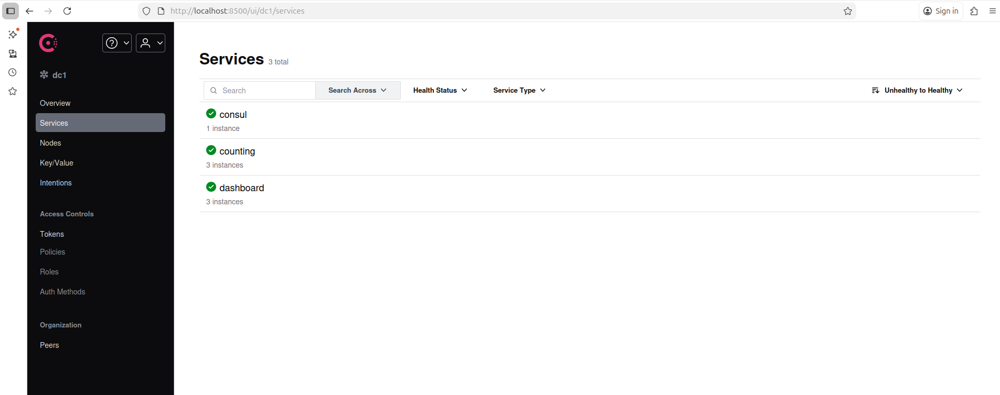

# Consul CI/CD Demo

This project demonstrates a multi-architecture Docker CI/CD pipeline with Consul service discovery. It shows how to register services in Consul for monitoring and visibility.

## Features
- **GitHub Actions CI/CD** builds and pushes multi-platform images for:
  - Linux AMD64 (Standard servers)
  - Linux ARM64 (ARM servers, Apple Silicon)
- **Docker Compose** launches:
  - 3 `counting-service` containers
  - 3 `dashboard-service` containers
  - 1 Consul agent for service registration/monitoring
  - 1 Registrator container for automatic service registration
- **Automatic Consul Registration**: All service containers are registered with Consul via a custom script with health checks

## Prerequisites

1. **GitHub Account** - Repository where code is hosted
2. **Docker Hub Account** - For storing Docker images
3. **Local Development Environment** - Docker and Docker Compose installed

## Quick Start

### 1. Build & Push Images (CI/CD)
Images are built and pushed to Docker Hub automatically via GitHub Actions when you push to the `main` branch.

- See `.github/workflows/ci-cd.yaml` for workflow details
- Images are multi-arch (amd64, arm64) and compatible with Linux and Apple Silicon
- Each push creates images with `latest` tag and commit SHA tag

### 2. Configure GitHub Secrets (First Time Only)

Go to your GitHub repository → **Settings** → **Secrets and variables** → **Actions** → **New repository secret**

Add the following secret:
- **Name:** `DOCKER_PASSWORD`
- **Value:** Your Docker Hub password or access token

If using a different Docker Hub username, update `DOCKER_USERNAME` in `.github/workflows/ci-cd.yaml`

### 3. Run the Stack

```sh
docker compose up -d --scale counting=3 --scale dashboard=3
```

This will start:
- 3 `counting-service` containers (port 9003)
- 3 `dashboard-service` containers (port 9002)
- 1 Consul agent (port 8500)
- 1 registrator container to auto-register services in Consul

### 4. Inspect Docker Network

```sh
docker network ls
docker network inspect ci-cd-demo_appnet
```

Example output:
```json
{
  "Name": "ci-cd-demo_appnet",
  "Driver": "bridge",
  "Subnet": "172.19.0.0/16",
  "Gateway": "172.19.0.1",
  "Containers": {
    "ci-cd-demo-consul-1": { "IPv4Address": "172.19.0.2/16" },
    "ci-cd-demo-counting-2": { "IPv4Address": "172.19.0.3/16" },
    "ci-cd-demo-counting-3": { "IPv4Address": "172.19.0.4/16" },
    "ci-cd-demo-counting-1": { "IPv4Address": "172.19.0.5/16" },
    "ci-cd-demo-dashboard-2": { "IPv4Address": "172.19.0.6/16" },
    "ci-cd-demo-dashboard-3": { "IPv4Address": "172.19.0.7/16" },
    "ci-cd-demo-dashboard-1": { "IPv4Address": "172.19.0.8/16" }
  }
}
```

### 5. Check Consul Registration

Wait a few seconds for the registrator to complete, then check the logs:

```sh
docker logs ci-cd-demo-registrator-1
```

Example output:
```
Registering counting-1 at 172.19.0.5:9003
 ✓
Registering counting-2 at 172.19.0.3:9003
 ✓
Registering counting-3 at 172.19.0.4:9003
 ✓
Registering dashboard-1 at 172.19.0.8:9002
 ✓
Registering dashboard-2 at 172.19.0.6:9002
 ✓
Registering dashboard-3 at 172.19.0.7:9002
 ✓

All services registered! Check http://localhost:8500/ui/dc1/services
```

### 6. Access Consul UI

Open your browser and navigate to:
```
http://localhost:8500
```

You should see all 6 services registered in the Consul UI with their health status, IP addresses, and service details:



### 7. Stop the Stack

When you're done:

```sh
docker compose down
```

## Project Structure

```
ci-cd-demo/
├── .github/
│   └── workflows/
│       └── ci-cd.yaml              # GitHub Actions workflow
├── counting-service/
│   ├── Dockerfile                  # Multi-platform Dockerfile
│   └── counting-service            # Go binary
├── dashboard-service/
│   ├── Dockerfile                  # Multi-platform Dockerfile
│   └── dashboard-service           # Go binary
├── docker-compose.yaml             # Consul + Services orchestration
├── register-services.sh            # Automatic Consul registration script
└── README.md
```

## How It Works

### CI/CD Pipeline
1. Push code to GitHub `main` branch
2. GitHub Actions triggers workflow
3. Builds Docker images for both AMD64 and ARM64 architectures
4. Pushes images to Docker Hub with `latest` and commit SHA tags

### Service Registration Flow
1. Docker Compose starts all containers (Consul, counting, dashboard services)
2. Containers get IPs from the Docker bridge network (`appnet`)
3. Registrator container waits 10 seconds for services to be ready
4. Registration script (`register-services.sh`) runs:
   - Discovers all running counting/dashboard containers
   - Extracts their IP addresses from Docker network
   - Registers each instance with Consul API
   - Configures HTTP health checks for each service
5. Consul monitors all registered services via health checks every 10 seconds
6. Consul UI displays real-time service health and status

